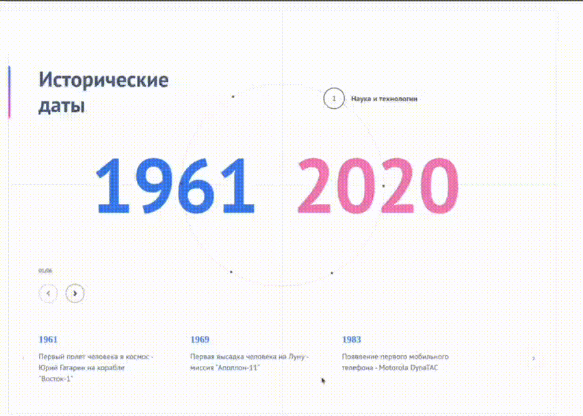

# About
History Slider - Интерактивный хронологический анимированный слайдер. Веб-приложение для просмотра исторических событий через круговой интерфейс

Проект представляет хронологию исторических событий через круговой навигатор, где каждая точка на окружности соответствует определенному историческому периоду. Пользователь может плавно перемещаться между эпохами, наблюдая синхронизированные анимации интерфейса.

## Stack
* React
* TypeScript
* Styled Components
* Webpack

# Запуск
Для локального запуска приложения нужно:

1. Иметь Node v16+.
1. Ввести в корне проекта:
```bash
npm i
npm run dev
```
2. Открыть [localhost:3000](http://localhost:3000/)

# How it works



