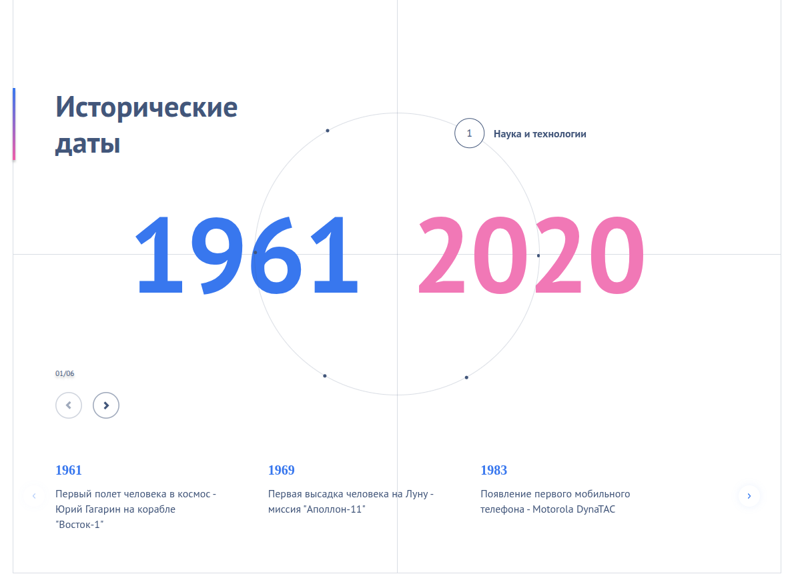

# About
History Slider - Интерактивная хронологический анимированный слайдер. Веб-приложение для интерактивного просмотра исторических событий через круговой интерфейс

Проект представляет хронологию исторических событий через круговой навигатор, где каждая точка на окружности соответствует определенному историческому периоду. Пользователь может плавно перемещаться между эпохами, наблюдая синхронизированные анимации интерфейса.

## How it works


<video controls src="./about/interface.webm" title="interface"></video>

# Dev
## Stack
React + TS + Styled Components + Webpack

## Requirements
* Node v16+
Для локального запуска приложения нужно:

1. Ввести в корне проекта:
```bash
npm i
npm run dev
```
2. Открыть [localhost:3000](http://localhost:3000/)

## Сборка
```bash
npm run build
```
